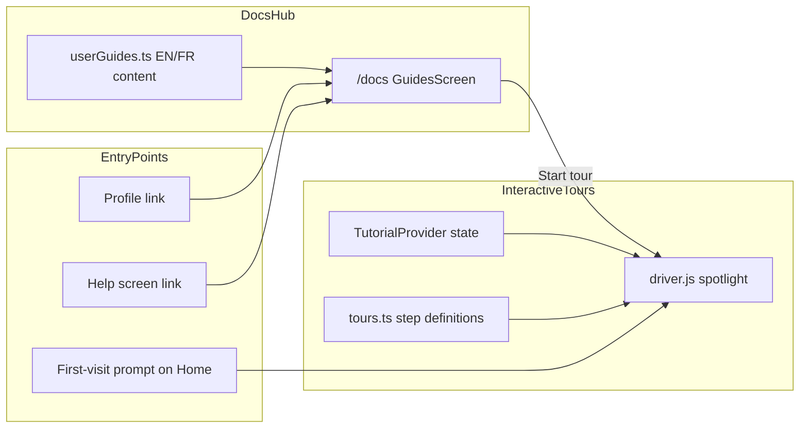

# Tutorials & Documentation Page Plan

## What you are building (in plain terms)

Two complementary pieces that work together:

1. **Documentation page** — a readable “how-to” hub where users browse guides by topic (navigation, player, search, profile).
2. **Interactive tutorials** — optional spotlight walkthroughs that highlight real UI elements step-by-step on the actual screens.

This mirrors how apps like Notion, Figma, or Netflix help users: static guides for reference, plus optional “Show me around” tours for first-time users.



---

## Recommended approach (and why)

| Decision | Recommendation | Why it fits your app |
|----------|----------------|----------------------|
| Tour library | **[driver.js](https://driverjs.com/)** (~4kb) | No tour lib today; driver.js is lightweight, works with CSS selectors, easy to theme for dark/light mode |
| Docs content format | **TypeScript data files** (like [`lib/releaseNotes.ts`](lib/releaseNotes.ts)) | You already use structured `{ en, fr }` objects + `t()` i18n — no markdown renderer needed for v1 |
| Docs vs Help | **Separate `/docs` route** | [`screens/HelpScreen.tsx`](screens/HelpScreen.tsx) is for bug reports / support tickets — mixing how-to guides there would confuse users |
| Persistence | **`localStorage`** (like `hasStarted`, `lastSeenVersion`) | Consistent with existing onboarding patterns in [`context/AppContext.tsx`](context/AppContext.tsx) |
| v1 scope | Getting Started, Player, Search, Profile | Per your preference — premium/subscriptions excluded |

**Not recommended for v1:** Firestore CMS for docs, react-markdown pipeline, or a fully custom tour overlay — all add complexity without clear benefit yet.

---

## Architecture

### New files

| File | Purpose |
|------|---------|
| [`lib/userGuides.ts`](lib/userGuides.ts) | Guide articles: id, category, title, summary, steps (EN/FR), linked `tourId` |
| [`lib/tours.ts`](lib/tours.ts) | Tour step definitions: selector, title, description, route (if navigation needed) |
| [`context/TutorialContext.tsx`](context/TutorialContext.tsx) | Tour state, start/stop/skip, completion tracking |
| [`components/TutorialHost.tsx`](components/TutorialHost.tsx) | Wraps driver.js init, theme-aware popover styling |
| [`components/TutorialPromptModal.tsx`](components/TutorialPromptModal.tsx) | “Want a quick tour?” modal on first Home visit |
| [`screens/GuidesScreen.tsx`](screens/GuidesScreen.tsx) | Documentation hub UI at `/docs` |

### Modified files

| File | Change |
|------|--------|
| [`App.tsx`](App.tsx) | Add `/docs` route, wrap with `TutorialProvider`, mount `TutorialHost` |
| [`lib/i18n.ts`](lib/i18n.ts) | New keys: `guides`, `startTour`, `skipTour`, `tourComplete`, etc. |
| [`screens/ProfileScreen.tsx`](screens/ProfileScreen.tsx) | Add “Guides & Tutorials” nav item → `/docs` |
| [`screens/HelpScreen.tsx`](screens/HelpScreen.tsx) | Add banner/link: “Looking for how-to guides? → Guides” |
| Target UI components | Add stable `data-tour="..."` attributes (see below) |

---

## Documentation page UX

**Route:** `/docs` (lazy-loaded like other screens)

**Layout** (matches existing screen patterns — back button, Tailwind cards, dark mode):

- **Header:** “Guides & Tutorials” + short subtitle
- **Category filter tabs:** All | Getting Started | Player | Search | Profile
- **Guide cards:** title, 1-line summary, estimated read time, “Read guide” + “Start tour” buttons
- **Guide detail view** (inline expand or sub-route `/docs/:guideId`):
  - Numbered steps with plain-language instructions
  - Optional Heroicons per step (no screenshots required for v1 — keeps scope small)
  - Primary CTA: **Start interactive tour**

**Content model** (mirrors release notes):

```typescript
// lib/userGuides.ts (sketch)
export interface GuideStep {
  en: string;
  fr: string;
}

export interface UserGuide {
  id: string;
  category: 'getting-started' | 'player' | 'search' | 'profile';
  tourId: string | null;  // links to lib/tours.ts
  title: { en: string; fr: string };
  summary: { en: string; fr: string };
  steps: GuideStep[];
  readMinutes: number;
}
```

**v1 guide articles (4 tours, ~3–5 steps each):**

1. **Getting Started** — bottom nav (Home / Search / Profile), sidebar categories (Documentaries, Productions, Podcasts), home feed sections
2. **Video Player** — play/pause, fullscreen, mini player, bookmark button, title suggestion pencil icon
3. **Search & Discovery** — search bar, filters/categories, opening a detail page
4. **Profile & Preferences** — history, favorites/bookmarks, language toggle, theme toggle, edit profile

---

## Interactive tutorial UX

### How tours work

1. User clicks **Start tour** on a guide (or accepts first-visit prompt)
2. `TutorialContext` navigates to the required route if needed (via `react-router` `navigate`)
3. After a short delay (DOM settle), `driver.js` highlights the element matching `[data-tour="step-id"]`
4. User clicks Next / Back / Skip; completion saved to `localStorage` (`completedTours: string[]`)

### Tour anchors to add

Stable `data-tour` attributes on key elements (no visual change):

| Selector | Component | Tour |
|----------|-----------|------|
| `data-tour="bottom-nav"` | [`components/BottomNav.tsx`](components/BottomNav.tsx) | Getting Started |
| `data-tour="sidebar-categories"` | [`components/Sidebar.tsx`](components/Sidebar.tsx) | Getting Started |
| `data-tour="home-hero"` | [`components/Hero.tsx`](components/Hero.tsx) or HomeScreen | Getting Started |
| `data-tour="search-input"` | Search screen / DesktopSearchBar | Search |
| `data-tour="player-controls"` | Player controls bar | Player |
| `data-tour="mini-player"` | [`components/PlayerScreenHost.tsx`](components/PlayerScreenHost.tsx) | Player |
| `data-tour="bookmark-btn"` | Player or detail screen | Player |
| `data-tour="suggest-title"` | Player / detail pencil icon | Player |
| `data-tour="profile-history"` | ProfileScreen history tab | Profile |
| `data-tour="profile-settings"` | ProfileScreen account tab | Profile |

### First-visit flow

After the user completes Get Started + lands on `/home` for the first time:

- Show a small modal (styled like [`components/WhatsNewModal.tsx`](components/WhatsNewModal.tsx))
- Options: **“Take the tour”** (starts Getting Started tour) | **“Maybe later”** | **“Don’t show again”**
- Stored in `localStorage.tutorialPromptDismissed`

### Re-launch anytime

- From `/docs` — “Start tour” on any guide
- From Profile — “Guides & Tutorials” menu item
- Optional: “Restart tour” link at bottom of each guide detail

---

## Styling driver.js for your theme

driver.js popovers will be customized via CSS to match Tailwind tokens:

- Light: white card, gray border, amber accent buttons (consistent with app CTAs)
- Dark: `dark:bg-gray-900`, `dark:border-gray-700`
- Read current theme from [`components/ThemeProvider.tsx`](components/ThemeProvider.tsx) or `document.documentElement.classList.contains('dark')`
- Popover text pulled from i18n based on `language` in AppContext

---

## i18n

Add keys to [`lib/i18n.ts`](lib/i18n.ts) for UI chrome only (`guides`, `startTour`, `nextStep`, `prevStep`, `skipTour`, `tourComplete`, `readGuide`, category labels).

Guide **content** stays in `userGuides.ts` as `{ en, fr }` objects (same pattern as release notes) — keeps translations co-located with content and avoids bloating the 900+ line i18n file.

---

## Implementation phases

### Phase 1 — Foundation (~half day)
- Install `driver.js`
- Create `TutorialContext`, `TutorialHost`, `userGuides.ts`, `tours.ts`
- Add `/docs` route + `GuidesScreen` with static guide list (no tours yet)
- Add i18n keys + Profile/Help links

### Phase 2 — Tour anchors (~half day)
- Add `data-tour` attributes across BottomNav, Sidebar, player, search, profile
- Implement 4 tour definitions in `tours.ts`
- Wire “Start tour” buttons on GuidesScreen

### Phase 3 — First-visit prompt + polish (~half day)
- `TutorialPromptModal` on first Home visit
- Dark/light popover theming
- Handle edge cases: element not found (skip step), user navigates away mid-tour (auto-cancel), mobile vs desktop (some steps hidden on mobile — document in tour config with `showOn: 'desktop' | 'mobile' | 'all'`)

### Phase 4 — Content & QA
- Write final EN/FR copy for all 4 guides
- Manual test on mobile + desktop, both languages, both themes
- Verify tours don’t conflict with existing modals (RGPD, WhatsNew, ProfileCompletion) — tours should only start when no blocking modal is open

---

## What stays unchanged

- [`screens/HelpScreen.tsx`](screens/HelpScreen.tsx) — remains the support/feedback channel
- Premium/subscription flows — out of scope for v1
- No Firestore backend for docs — content ships with the app (fast, offline-friendly PWA)

---

## Future extensions (not v1)

- Markdown authoring for non-developers (`react-markdown` + `.md` files in `content/guides/`)
- Admin panel to edit guides in Firestore
- Video/GIF step illustrations
- Analytics: track which tours are started vs completed (Firebase Analytics events)
- Premium guide when that feature is ready
